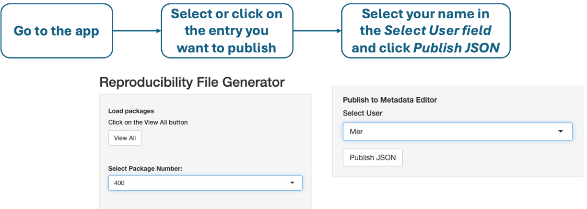
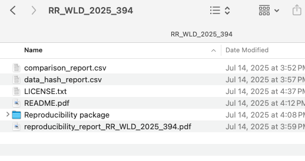

# Metadata Protocol for Reproducibility Packages

This protocol outlines the steps and field requirements for creating high-quality metadata for reproducibility packages. It is primarily intended to guide metadata producers and reviewers in preparing comprehensive documentation. It can also serve as a reference for authors to understand how their materials will be documented. The goal is to ensure that entries published on the [Reproducible Research Repository](https://reproducibility.worldbank.org/) are complete, consistent, and aligned with verification standards.

The protocol has three components:

1. **Process Description** – How metadata is created and published.
2. **Metadata Fields** – Detailed guidance on each field, indicating which are pre-filled.
3. **External Resources Structure** – The required folder structure accompanying the package.

---

## Metadata Creation and Publication Process

* World Bank staff and consultants submit reproducibility verification requests via the [SurveyCTO form](https://survey.wb.surveycto.com/collect/prwp_reproducibility?caseid=undefined).
* The [app](https://datanalytics-int.worldbank.org/RR-automation-SCTO/) automatically fills most metadata fields using this information.
* The reviewer opens the app, selects the package to publish, assigns their name, and clicks **Publish JSON** to generate the metadata entry in the Metadata Editor.

### Steps

1. **Go to the app** – Select the entry you want to publish.
2. **Generate JSON** – Publish the package JSON from the app to the Metadata Editor.

3. **Review and Edit Metadata** – In the Metadata Editor:

   * Upload a thumbnail.
   * Verify auto-filled fields (detailed guidance in the next section).
   * Complete the **Data section** with dataset provenance and access statements.
   * Upload **External resources**: README, reproducibility report, license, data hash report, and optional comparison report.
   * Check that **tags** (DOI, Data Access, Code Access) are correctly defined.
4. **Publish to QA** – Save and publish the entry to the QA catalog.
5. **TTL Review** – Send the QA link to the TTL for approval.
6. **Publish to Production** – After TTL approval, finalize publication in PROD.

---

## Metadata Fields

### Auto-Filled Fields

Review and correct these fields as needed:

* **Metadata Information**

  * **Producers**: `Reproducibility WBG, DECDI, World Bank - Development Impact Department, Verification and preparation of metadata`
  * **Production Date**: Year-month-day.
  * **Version**: Default is 1. Update only if it’s a revised entry.

* **Title Statement**

  * **Primary ID**: Auto-generated (e.g., `RR_URY_2025_400`). Ensure it matches the package folder name.
  * **Title**: “Reproducibility package for \[Paper Title]”.

* **Authors and Contributors**: Ensure all entries have name, affiliation, and email.

* **Version Statement**

  * **Project completion date**: Year-month-day indicating when the paper was finalized. If day is not available Year-month is enough. 

* **Scope and Coverage**

  * **Abstract**: Check for formatting issues or copy directly from the paper.
  * **Geographic Areas**: Use ISO-3 codes for countries or regions. For multi-country projects across regions, use `WLD` (World). For regional papers, use region codes such as `LAC`, `MNA`, `SSA`, or `AFR`.
  * **Keywords, Topics, JEL Codes**: Extracted from author responses or copy from the paper.

* **Output Section**

  * **Output Type**: *Working Paper*, *Journal Article*, or *Flagship Report/Dataset*.
  * **Title**: Title of the paper.
  * **Authors**: Authors of the paper.
  * **Description**:

    * *Working Paper*: `Policy Research Working Paper (PRWP) ####`
    * *Journal Article*: Name of the journal (or leave blank if unknown).
    * *Flagship/Report*: “Flagship and report” or specify dataset name.
  * **License**: Add license type if available (not pre-filled).
  * **Language**: English.

* **Access and Rights**

  * **Disclaimer**: Ensure it is not “Default”; publish the actual text.
  * **License**: `Modified BSD3` with URL: [https://opensource.org/license/bsd-3-clause/](https://opensource.org/license/bsd-3-clause/).

* **Contacts**: Prefilled with main authors and the reproducibility team. Verify accuracy.

* **Methods, Software, and Scripts**

  * **Software**: Add version number (e.g., Stata 18.0 MP).
  * **Scripts**: Prefilled but verify:

    * File name and ZIP package match ID (e.g., `RR_URY_2025_400.zip`).
    * Title matches “Reproducibility package for \[Paper Title]”.
    * Dependencies reference ado folder / `renv.lock` / `requirements.txt`.
    * Notes include: “Computational reproducibility verified by the Development Impact Analytics Team, World Bank.”

* **Repository**: Usually “Reproducible Research Repository (World Bank)” with URL [https://reproducibility.worldbank.org](https://reproducibility.worldbank.org). Update only if replication was hosted by a journal or another repository.

---

### Manual Input Fields: Data Section

Choose the most restrictive applicable **Data Availability Statement**:

* All data sources are publicly available and included in the reproducibility package.
* All data sources are publicly available but not all are included in the reproducibility package.
* All data is not yet publicly available but is expected to be made available through the World Bank Microdata Library in the future.
* Some data is not yet publicly available but is expected to be made available through the World Bank Microdata Library in the future.
* All data is temporarily embargoed by the authors (expected to be made public in the future).
* Some data is temporarily embargoed by the authors (expected to be made public in the future).
* Some data is restricted and has not been included in the reproducibility package. For more details, refer to the README file.
* All data is restricted and has not been included in the reproducibility package. For more details, refer to the README file.

For each dataset, include:

* **Dataset Name**: Descriptive name (e.g., “World Development Indicators”).
* **Note**: Include source (or citation), file location, and access instructions. Example:

  > Source: World Bank. File name: `gdp_wdi.dta`. Located in `Summary/1-data/raw/other`. Indicators: GDP (constant 2015 US\$).
* **Access Policy**: Choose from:

  * Publicly available and included in package.
  * Data created specifically for the project and included in package.
  * Restricted and not included (README must document access).
  * Public but cannot be redistributed (requires comparison).
  * Requires purchase or human approval.
  * No documented way to access.
* **License**: e.g., `Creative Commons Attribution 4.0 (CC-BY 4.0)`.
* **License URL**: URL for the dataset license (e.g., [WDI Terms of Use](https://www.worldbank.org/en/about/legal/terms-of-use-for-datasets)).
* **Data URL**: Direct download URL (if available).

---

### Reproducibility Section

* **Reproduction Instructions**: Add detailed steps to reproduce findings, including environment setup and path adjustments.

  * Stata (restricted data example): [Link](https://reproducibility.worldbank.org/index.php/catalog/311)
  * R example: [Link](https://reproducibility.worldbank.org/index.php/catalog/267)
  * Python example: [Link](https://reproducibility.worldbank.org/index.php/catalog/243)
* **Technology Requirements**: Approximate run time (minutes/hours). Example: ~10 minutes run time. 
* **Technology Environment**: Document system specifications used for reproduction (match reproducibility report). Example:

Paper exhibits were reproduced on a computer with the following specifications:

- OS: Windows 11 Enterprise
- Processor: Intel(R) Core(TM) i5-1145G7 CPU @ 2.60GHz
- Memory: 15.7 GB
- Software: Stata 18.0 MP

---

## External Resources

Attach the following resources:

- `README.pdf`  
  - **Resource type:** Document, Other  
  - **Title:** README for the reproducibility package for *[Title]*  

- `reproducibility_report_PID.pdf`  
  - **Resource type:** Document, Other  
  - **Title:** Reproducibility verification for *[Title]*  

- `RR_WLD_2024_100.zip`  
  - **Resource type:** Document, Other  
  - **Title:** Reproducibility package for *[Title]*  

The `RR_WLD_2024_100.zip` file must include:

- `README.pdf`  
- `LICENSE.txt` (available [here](https://github.com/worldbank/wb-reproducible-research-repository/tree/main/resources/LICENSE.txt); ensure the year is updated)  
- `reproducibility_report_PID.pdf`  
- `data_hash_report.csv` (created with the [hash tool](https://github.com/worldbank/wb-reproducible-research-repository/tree/main/resources/generate_hash))  
- `comparison_report.csv` (include if data type is Limited Access or Accessible; created with the [data comparison tool](https://github.com/worldbank/wb-reproducible-research-repository/tree/main/resources/compare_datasets))  
- `Reproducibility package/` folder containing the original code and data (e.g., `ado` folder for Stata, `renv` or `myenv` for R/Python).

> **Note:** Place `README.pdf`, `LICENSE.txt`, `reproducibility_report_PID.pdf`, `data_hash_report.csv`, and `comparison_report.csv` at the **top level** of the ZIP file, not inside the `Reproducibility Package` folder, for immediate visibility. 

---

### Tags

Ensure tags are added and correct:

* **DOI**: DOI number.
* **Data Access**:

  * Open data: freely downloadable and redistributable.
  * Accessible data: freely downloadable but cannot be redistributed (e.g., MDL public use).
  * Limited-access data: requires purchase or human approval (e.g., MDL licensed data).
  * Restricted data: no documented access method or requires ad-hoc agreements.
* **Code Access**:

  * Open code: code included and accessible.
  * Restricted code: proprietary or not included (temporary embargo counts as restricted).
  * No code: package includes only manual (e.g., Excel) processes.

