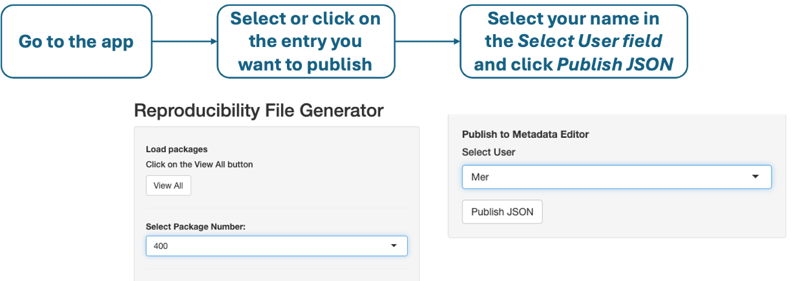
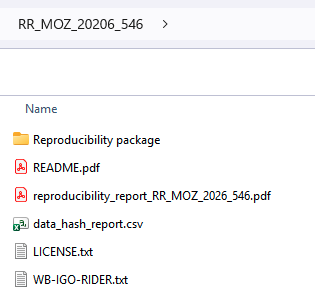

# Metadata Protocol for Reproducibility Packages

This protocol outlines the steps and field requirements for creating high-quality metadata for reproducibility packages. It is primarily intended to guide metadata producers and reviewers in preparing comprehensive documentation. It can also serve as a reference for authors to understand how their materials will be documented. The goal is to ensure that entries published on the [Reproducible Research Repository](https://reproducibility.worldbank.org/) are complete, consistent, and aligned with verification standards.

The protocol has four components:

1. **Process Description** – How metadata is created and published.
2. **Metadata Fields** – Detailed guidance on each field, indicating which are pre-filled.
3. **External Resources Structure** – The required folder structure accompanying the package.
4. **Post-Publication Updates** – Fields to review or revise after metadata creation and publication.

---

## Metadata Creation and Publication Process

* World Bank staff and consultants submit reproducibility verification requests via the [SurveyCTO form](https://survey.wb.surveycto.com/collect/prwp_reproducibility?caseid=undefined).
* The internal app automatically fills most metadata fields using this information.
* The reviewer opens the app, selects the package to publish, assigns their name, and clicks **Publish JSON** to generate the metadata entry in the Metadata Editor.

### Steps

1. **Go to the app** – Select the entry you want to publish.
2. **Generate JSON** – Publish the package JSON from the app to the Metadata Editor.



3. **Review and Edit Metadata** – In the Metadata Editor:

   * Upload a thumbnail.
   * Verify auto-filled fields (detailed guidance in the next section).
   * Complete the **Data section** with dataset provenance and access statements.
   * Complete the **Reproducibility Section** with the reproduction instructions, technology requirements, and technology environment used (detailed guidance in the next section).
   * Upload **External resources**: README, reproducibility report, license, data hash report, and optional comparison report.
   * Check that **tags** (DOI, Data Access, Code Access) are correctly defined.
4. **Publish to QA** – Save and publish the entry to the QA catalog. To publish to QA:
   - Click on the three dots next to the save icon and select **Publish to NADA**.
   - **Catalog**: Select `RRR QA` (https://reproducibilityqa.worldbank.org/).
   - **Project options**:
     - Overwrite if already exists?: `Yes`
     - Publish: `Publish`
     - Data access: `Data not available` [default]
     - Collection: Choose the collection accordingly.
   - **External Resources**: Toggle to `Overwrite resources` and select all three.
   - **Options**: Toggle `Yes` to all.
   - Click **Publish**.
5. **TTL Review** – Send the QA link to the TTL for approval.
6. **DECDG Review** - After TTL approval, add the QA link to the [Excel file (internal)](https://worldbankgroup.sharepoint.com/:x:/r/teams/DECReproducibilityVerification-WBGroup/_layouts/15/Doc.aspx?sourcedoc=%7B85BCD5CD-A897-421F-AA99-F78CFAC3FF7F%7D&file=Reproducibility%20packages-DECDG%20review.xlsx&action=default&mobileredirect=true) for DECDG's review. Share the temporary link with the authors.
7. **Publish to Production** – After DECDG's approval, finalize publication in PROD. Follow the same steps as step 4, but with the following change:
   - **Catalog**: Select `RRR` (https://reproducibility.worldbank.org/) instead of `RRR QA`.
8. **Add to Collection** – Add the metadata entry to the Reproducible Research Repository collection:
   - On the Metadata Editor page, locate the entry in the list.
   - Click on the three dots under the **Actions** column for the entry.
   - Click **Add to Collection**.
   - Select **Reproducible Research Repository**.

---

## Metadata Fields

### Auto-Filled Fields

Review and correct these fields as needed:

* **Metadata Information**

  * **Producers**: `Reproducibility WBG, DECDI, World Bank - Development Impact Department, Verification and preparation of metadata`
  * **Production Date**: Year-month-day.
  * **Version**: Default is 1. Update only if it’s a revised entry.

* **Title Statement**

  * **Primary ID**: Auto-generated (e.g., `RR_URY_2025_400`). Ensure it matches the package folder name.
  * **Title**: “Reproducibility package for \[Paper Title]”.

* **Authors and Contributors**: Ensure all entries have name, affiliation, and email.

* **Version Statement**

  * **Project completion date**: Auto-generated. Year-month-day indicating when the paper was finalized. 

* **Scope and Coverage**

  * **Abstract**: Check for formatting issues or copy directly from the paper.
  * **Geographic Areas**: Use ISO-3 codes for countries or regions. For multi-country projects across regions, use `WLD` (World). For regional papers, use region codes such as `LAC`, `MNA`, `SSA`, or `AFR`.
  * **Keywords, Topics, JEL Codes**: Extracted from author responses or copy from the paper.

* **Output Section**

  * **Output Type**: *Working Paper*, *Journal Article*, or *Flagship Report/Dataset*.
  * **Title**: Title of the paper.
  * **Authors**: Authors of the paper.
  * **Description**:

    * *Working Paper*: `Policy Research Working Paper (PRWP) ####`
    * *Journal Article*: Name of the journal (or leave blank if unknown).
    * *Flagship/Report*: “Flagship and report” or specify dataset name.
  * **License**: Add license type if available (not pre-filled).
  * **Language**: English.

* **Access and Rights**

  * **Disclaimer**: Ensure it is not “Default”; publish the actual text.
  * **License**: `Modified BSD3` with URL: [https://opensource.org/license/bsd-3-clause/](https://opensource.org/license/bsd-3-clause/).

* **Contacts**: Prefilled with main authors and the reproducibility team. Verify accuracy.

* **Methods, Software, and Scripts**

  * **Software**: Add version number (e.g., Stata 18.0 MP).
  * **Scripts**: Prefilled but verify:

    * File name and ZIP package match ID (e.g., `RR_URY_2025_400.zip`).
    * Title matches “Reproducibility package for \[Paper Title]”.
    * Dependencies reference ado folder / `renv.lock` / `requirements.txt`.
    * Notes include: “Computational reproducibility verified by the Development Impact Analytics Team, World Bank.”

* **Repository**: Usually “Reproducible Research Repository (World Bank)” with URL [https://reproducibility.worldbank.org](https://reproducibility.worldbank.org). Update only if replication was hosted by a journal, if the package was already published to another repository, or if we had to use the [Development Data Hub](https://datacatalog.worldbank.org/) to upload the reproducibility package because it had a size of over 500 MB.

---

### Manual Input Fields: Data Section

Choose the most restrictive applicable **Data Availability Statement**.
>This should match the **Data** statement under *Reproducibility Summary* in the Reproducibility Report.:

* All data sources are publicly available and included in the reproducibility package.
* All data sources are publicly available but not all are included in the reproducibility package.
* All data is not yet publicly available but is expected to be made available through the World Bank Microdata Library in the future.
* Some data is not yet publicly available but is expected to be made available through the World Bank Microdata Library in the future.
* All data is temporarily embargoed by the authors (expected to be made public in the future).
* Some data is temporarily embargoed by the authors (expected to be made public in the future).
* Some data is restricted and has not been included in the reproducibility package. For more details, refer to the README file.
* All data is restricted and has not been included in the reproducibility package. For more details, refer to the README file.
* * Some data is limited-access and has not been included in the reproducibility package. For more details, refer to the README file.
* All data is limited-access and has not been included in the reproducibility package. For more details, refer to the README file.

For each **DATA SOURCE**, include:

- **Dataset Name**: Descriptive name (e.g., "World Development Indicators"). A data source is not necessarily the same as an input file, for example, a survey split across multiple files should be documented once, with individual filenames listed in the **Note** field.

- **Note**: Include the access date, file location(s) within the package, and any relevant access instructions or details (e.g., indicators used, variable descriptions, data transformations applied by the authors). Example:
  > Data accessed in September 2024. File location: `data/raw/gdp_wdi.dta`. Indicators used: GDP (constant 2015 US$).

- **Access Policy**: Choose the option that most accurately reflects the data's access and redistribution status:

  - **Open data**:
    - Data is publicly available and included in the reproducibility package.
    - Data is publicly available but not included in the reproducibility package due to file size constraints.
  - **Accessible data**: Data is publicly available but does not allow redistribution and is not included in the reproducibility package.
  - **Limited-access data**: Data access requires purchase or human approval and is not included in the reproducibility package.
  - **Forthcoming data**: Data is forthcoming in the World Bank Microdata Library or the World Bank Development Data Hub.
  - **Restricted data**:
    - There is no documented way to access the data, and it is not included in the reproducibility package.
    - Data access was granted directly to the study authors by the data owners/managers. It was obtained with a custom data license that does not allow for redistribution and it is not included in the reproducibility package.

- **License**: License name, e.g., `Creative Commons Attribution 4.0 (CC BY 4.0)` (if available).

- **License URL**: URL for the dataset license (if available), e.g., [WDI Terms of Use](https://www.worldbank.org/en/about/legal/terms-of-use-for-datasets).

- **Data URL**: Direct download URL (if available). If multiple URLs apply, include them in the **Note** field instead.

- **Citation**: Full citation for the dataset, following standard dataset citation format, e.g.,
  >World Bank. 2025. "World Development Indicators" [dataset]. Indicator accessed: GDP per capita. https://databank.worldbank.org/source/world-development-indicators. Accessed September 2024.
  
  For author-compiled datasets, use one of the following formats:
  - When compiled for a specific report or publication:
    > Authors' compilation. 2025. International Accreditation Forum Data [dataset]. World Bank, World Development Report 2025 – Standards for Development.
  - When compiled from multiple sources:
    > Authors' compilation. 2026. Global Monitoring of School Closures and Human Capital Index [dataset]. Based on UNESCO's Global Monitoring of School Closures Caused by the COVID-19 Pandemic and the World Bank's Human Capital Project.

   **Tip:** Use the [README Generator](https://dime-worldbank.github.io/wb-reproducible-research-repository-automation/) to create dataset citations. 

---

### Reproducibility Section

- **Reproduction Instructions**:

  Add detailed steps to reproduce findings, including accessing data, environment setup, and path adjustments. The instructions should follow this structure:
  ```
  To reproduce the findings in this paper, a replicator must:
  1. **Secure Access to Data:** Access the datasets not included in the package. See the Datasets section for more details.
  2. **Run the Package:**
    - Update the working directory in line 19 of the do-file `00_master`, and run it.
  
  Since all the original data cannot be redistributed, the package includes the outputs produced by the authors, which can be used to review the results presented in the paper.
  ```
  See additional examples:
    - [Stata (restricted data example)](https://reproducibility.worldbank.org/index.php/catalog/311)
    - [R example](https://reproducibility.worldbank.org/index.php/catalog/267)
    - [Python example](https://reproducibility.worldbank.org/index.php/catalog/243)

- **Technology Requirements**:

  Approximate run time in minutes or hours. Example: `Run time: ~10 minutes`

- **Technology Environment**:

  Document the system specifications used for reproduction. This should match the specifications reported in the reproducibility verification report. Example:
  
  ```
   Paper exhibits were reproduced on a computer with the following specifications:
   - OS: Windows 11 Enterprise
   - Processor: Intel(R) Core(TM) i5-1145G7 CPU @ 2.60GHz
   - Memory: 15.7 GB
  ```

---

## External Resources

Attach the following resources:

- `README.pdf`  
  - **Resource type:** Document, Other  
  - **Title:** README for the reproducibility package for *[Title]*  

- `reproducibility_report_PID.pdf`  
  - **Resource type:** Document, Other  
  - **Title:** Reproducibility verification for *[Title]*  

- `RR_WLD_2024_100.zip`  
  - **Resource type:** Program / script
  - **Title:** Reproducibility package for *[Title]*  

The `RR_WLD_2024_100.zip` file must include:

- `README.pdf`
  - If the README and Data Availability Statement (DAS) are provided as separate documents, combine them into a single file and include it as a PDF.
- `LICENSE.txt` (available [here](https://github.com/worldbank/wb-reproducible-research-repository/tree/main/resources/LICENSE.txt); ensure the year is updated)
- `reproducibility_report_PID.pdf`
- `data_hash_report.csv` (created with the [hash tool](https://github.com/worldbank/wb-reproducible-research-repository/tree/main/resources/generate_hash))
- `comparison_report.csv` (include if data type is Limited Access or Accessible; created with the [data comparison tool](https://github.com/worldbank/wb-reproducible-research-repository/tree/main/resources/compare_datasets))
- `Reproducibility package/` folder containing the original code and data. When preparing this folder, ensure the following:
  - The folder must be named `Reproducibility package` exactly.
  - The data folder must only include data that is publicly available and can be published in a public repository. Restricted, limited-access, or accessible data must not be included.
  - Include code outputs (e.g., tables, figures) only if not all data can be published, so that results can still be reviewed without access to the restricted data.
  - Include empty folders where data cannot be published, to prevent the code from breaking due to missing directories. For example, if restricted data is expected in `data/raw`, include that folder as an empty placeholder.
  - For Stata packages, include the `ado` folder containing all user-written dependencies.
  - For R or Python packages, include `renv` (`renv.lock`, `.Rprofile`, and `renv/activate.R`) or `myenv` as applicable.

**Note:** Place `README.pdf`, `LICENSE.txt`, `reproducibility_report_PID.pdf`, `data_hash_report.csv`, and `comparison_report.csv` at the **top level** of the ZIP file, not inside the `Reproducibility Package` folder, for immediate visibility. 



---

### Tags

Ensure tags are added and correct:

- **DOI**: `DOI`.

- **Data Access**: Use the most restrictive tag that applies across all datasets in the package. For instance, if some data is restricted and some is open, use Restricted; if some data is limited-access and some is accessible, use Limited-access.

  - Open data: all data is freely downloadable and redistributable.
  - Accessible data: data is freely downloadable but cannot be redistributed (e.g., World Bank Microdata Library public use files).
  - Limited-access data: data requires purchase or human approval to access (e.g., World Bank Microdata Library licensed data).
  - Restricted data: data has no documented access method, or access was granted directly to the authors under a custom or ad-hoc agreement that does not allow redistribution.

  If the package includes synthetic data in place of restricted original data, add a second Data Access tag with the value "Synthetic data", in addition to the most restrictive access tag for the original data. In total there will be two rows for Data Access in this case.

- **Code Access**: Use the most restrictive tag that applies.

  - Open code: code is included in the package and freely accessible.
  - Restricted code: code is proprietary, not included in the package, or is under a temporary embargo.
  - No code: the package includes only manual processes (e.g., Excel-based analysis with no scripts).

---

## Post-Publication Updates

Once the paper is published or the data embargo is lifted, the following updates should be made to ensure the metadata remains accurate and complete:

1. **Thumbnail**  
   Replace the existing thumbnail with a screenshot of the *published* version of the paper.

2. **Output Section**  
   Update the following fields under the *Processes and Outputs* section:
   - **Description**: Add the publication number, e.g., *Policy Research Working Paper (PRWP) No. 11165*.
   - **URL**: Link to the final published paper.
   - **DOI**: Enter the DOI provided at publication.

3. **Data Section**  
   - If data previously marked as *forthcoming* is now available, verify that it matches the version originally included in the reproducibility package. Then update the dataset’s **URL** and **notes** fields accordingly.
   - If an embargo has been lifted, update the dataset’s **URL** and **notes** fields accordingly.

   
