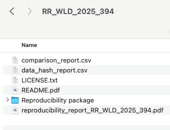

 
# PRWP Reproducibility Protocol

This protocol outlines the step-by-step process for verifying the reproducibility of research packages submitted to the World Bank’s PRWP verification team. It ensures that findings can be independently reproduced using the submitted code, data, and instructions. The protocol covers the full workflow—from submission and completeness checks (including data access and documentation), to running the package in a clean environment, tracking changes via version control, verifying consistency with the manuscript, and ultimately publishing the final reproducibility package.

In brief, the process looks like:

Find the detailed workflow below:

## 1. Receive submission

- Submissions are received via the [submission form](https://survey.wb.surveycto.com/collect/prwp_reproducibility?caseid=).
- **SurveyCTO** automatically sends an acknowledgment email to authors, indicating that a confirmation will follow within two business days.
- **Project coordinator** responsibilities:
  - Log each new submission in the GitHub project board.
  - Open an issue with the format **ID: TYPE_LOCATION_YEAR_NUMBER** (example: RR_NGA_2024_213).
  - Types options are the following.
    - **PP**: published paper.
    - **RR**: Policy Research Working Paper.
    - **FR**: Flagships and reports (includes databases).
  - Assign a reviewer, download the submitted files, and store them in the designated internal SharePoint folder named after the review ID.
    - For multiple versions of a package, zip each version separately and place them in a subfolder `files_submitted` with subfolders named `v1`, `v2`, etc., for organized tracking.
- _Special Case_: If a package is submitted via email instead of the form, respond with a request to complete [the submission form](https://survey.wb.surveycto.com/collect/prwp_reproducibility?caseid=), and share the [reproducibility guidance resources](https://worldbank.github.io/wb-reproducible-research-repository/) in your reply.

**General notes**:
- **Record Time Spent**: Record the total time spent on the review from receipt to publication. You can use [Toggl](https://track.toggl.com/) for accurate tracking.
- **Document Author Communications**: Author communications should be documented in the GitHub issue, either by copying the full email or summarizing key discussion points and dates. If coordinator review is needed, reviewers can tag the coordinator in the issue.

## 2.a Verify completeness

- Reviewer verifies the package includes all components as per the checklist [here](https://github.com/worldbank/wb-reproducible-research-repository/blob/main/reproducibility_package_checklist.md):
  - [ ] Code files going from original data to the results in the paper (and ideally nothing else).
  - [ ] The raw data files required for analysis.
  - [ ] The raw outputs.
  - [ ] A README file that explains how to run the package and explains data sources and any access restrictions. It's also okay if data details are provided in a separate data availability statement.
  - [ ] A link to the manuscript (if already published) or the manuscript itself.
  - [ ] Make note of any missing components (even if they do not affect the running of the package).
  - [ ] If the package has no README and no information on the data, it gets returned to the author. If there is no main script, but the README is clear, we can work with that; but ideally, it would contain a main script.

## 2.b Verify data access

- [ ] Verify the status of the data: is it public, is it private, or is it public but can't be redistributed?
  - If the data cannot be directly included in the package (private, confidential, or public but not allowed to be republished), verify that the data is accessible by following instructions in the README or data availability statement.
- [ ] Verify that data provenance information is complete. This should include:
  - Dataset name
  - Date it was accessed. Month, year is enough.
  - If the data is accessible in a website, it should have a data URL where it can be downloaded.
  - If the data is restricted, the data information should include how it was accessed and how other users could access the data.
- [ ] Verify if the README has the Statement about Rights.
- [ ] Initiate the entry in the metadata editor and verify that we have everything we need for the publication of the package, especially in terms of clarity in the data sources.
- [ ] If the package has not enough information on the data, ask the authors for all missing information.

## 2.c Verify Public Data

- [ ] For datasets that are publicly accessible but cannot be republished in the package, verify that the publicly available version matches the data provided by the authors.  
  - Use the [Dataset Comparison and Reproducibility Verification Tool](https://github.com/worldbank/wb-reproducible-research-repository/tree/main/resources/compare_datasets) to compare datasets.  
  - The tool will generate a `detailed_report.csv` that **must** be included in the final package.  
  - Document any differences between the two versions:  
    - If differences are due to **periodic updates**, note this in the verification report.  
    - If differences are due to **manual changes**, request that the authors ensure the correct version is used and included in the package.  
- [ ] Create dataset hashes for all data files used in the package.  
  - Use the [Data Hash Tool](https://github.com/worldbank/wb-reproducible-research-repository/tree/main/resources/generate_hash) to generate hashes.  
  - The tool will produce a hash report file that must be included in the final reproducibility package.

## 3. Start a clean programming environment

- [ ] Start with clean environments to avoid dependency conflicts. Follow these instructions:
  - **Stata:** [Link to instructions](https://worldbank.github.io/wb-reproducible-research-repository/resources/environment-instructions/stata.html)
  - **R:** [Link to instructions](https://worldbank.github.io/wb-reproducible-research-repository/resources/environment-instructions/R.html)
  - **Python:** [Link to instructions](https://worldbank.github.io/wb-reproducible-research-repository/resources/environment-instructions/python.html)

## 4. Version control with Git

- To see the differences between the author's package and our package across multiple runs, create a Git repository.
- [ ] Open GitHub Desktop and create a new repository in the location of the package.
- [ ] Add the `.gitignore` file to avoid tracking all the files. You can use [this template](https://github.com/worldbank/DIME-LaTeX-Templates/blob/master/.gitignore), but you might need to adapt it.
- [ ] Commit the initial package sent by the authors.
- [ ] Important: We only a local repository for this process, we won't publish this **ever** on GitHub.com.

This will help you see if the outputs are changing after you run the code.

## 5. Run the Package

- [ ] **Delete existing outputs and intermediate data** before running the package.  
  - This ensures that the code runs fully from raw data to analysis results, and all outputs are generated by the code. This step is done after setting the Github repo, as it ensure you will be able to comapre if your exhibits match those of the authors.  
  - If the package contains files (e.g., Excel files) where authors manually transformed results into figures, do **not** delete these files. Ensure they are explained in the README.  
- [ ] **Run the package from start to finish** by only changing the top-level directory.  
- [ ] **Document any code modifications** needed for a successful run.  
- [ ] **Troubleshoot errors** if the package does not run. Often, these are due to missing dependencies.  
- [ ] **Commit your progress** to the Git repository with the commit message: `first-run`.  

### Document these critical aspects as you prepare and run the package:

#### 1. Dependencies
- [ ] **List all dependencies**: Save all libraries, packages, and other dependencies required for the package.  
  - This will be saved automatically in:
    - Stata → `ado` folder  
    - Python → `environment.yml`  
    - R → `renv.lock`  

#### 2. Changes Made
- [ ] **Document all changes made**: Note any code adjustments, package installations, or path modifications needed for the package to run.  
- [ ] All changes are tracked in Git automatically; use these commits to document changes in the GitHub issue.  

#### 3. System Information
- [ ] **Record system details**:  
  - Operating System  
  - Processor  
  - Available Memory  
  - Software Version (including Stata edition)  
  
## 6. Confirm Initial Run and Verify Stability 

- [ ] If the package runs successfully:
  - [ ] Note the total run time.  
- [ ] **Verify stability**:
  - [ ] Run the package a second time to ensure results are stable.  
  - [ ] If the package takes more than 48 hours to run, a second full run is not required.  
  - [ ] Use Git locally to track changes.  
    - If outputs are stable, you should not see changes in `.txt`, `.png`, `.jpg`, or `.csv` files.  
    - Files such as `.dta` and `.xlsx` may show changes due to metadata (e.g., timestamps); this does not necessarily indicate instability.  
  - [ ] Confirm that outputs remain consistent across runs.  
  - [ ] If discrepancies occur:
    - Document the differences and update the Git repo.  
    - For Stata packages, run `reprun` to locate where discrepancies arise.  
    - For R/Python packages or if `reprun` does not work, discuss with the coordinator/team to identify issues.  
    - Return the package to authors with a detailed explanation of the issues.  
- [ ] **Send confirmation to authors** with an estimated report return date (2 weeks).  
- [ ] Notify authors of any missing information required for publication.  

## 7. Verify consistency with the manuscript

- [ ] For papers with more than 10 exhibits in the appendix, randomly select 10 exhibits for review using [this randomization code](https://github.com/worldbank/wb-reproducible-research-repository/blob/main/resources/select_appendix_exhibits.do).
- [ ] Compare the raw outputs generated when running the package to the exhibits in the paper:
  - **Tables**: Check for consistent observation numbers, identical coefficients and standard errors, and matching signs and significance indicators.
  - **Graphs**: Ensure axes, legends, and visual values are consistent.
- [ ] Identify exhibits not requiring reproduction, like timeline figures, and note any tables or analytical outputs not produced by the code provided.
- [ ] Document any discrepancies at the table level and note them in the report (next step). If the authors included their code outputs in the reproducibility package, compare your code outputs with theirs.

## 8. Draft Reproducibility Report

- [ ] Use the Overleaf template [here](https://www.overleaf.com/2996348989fbgvwfqrxgtj#6ccc49) or the template generator (internal only) [here](https://github.com/dime-worldbank/prwp-reproducibility-int/tree/main/verification_report_template/template_generator) to produce a first draft of the reproducibility report.
  - [ ] **Successful Reproduction**:
    - List any code suggestions separately and communicate then to the authors via email when sending the results.
    - In the "Main Findings" section of the report, do not include procedural steps already incorporated into the final package. For example, omit details like the execution of `set varabbrev on` or the installation of libraries that are already included in the provided code. Only include what external users will need to modify to run the code on their computers.
  - [ ] **Unsuccessful Reproduction**:
    - In the "List of exhibits" section of the report include a screenshot of your code results and the paper exhibit. Highlight all the differences so they're noticeable by the authors. For each exhibit, mention any pattern in the discrepancies you might have noticed.
    - Send the report by email. In your email, include a summary of the exhibits that didn't reproduce and actionable information with your suggestions on how to address the reproducibility issue. Discuss this with the coordinator or rest of the team if needed.
- [ ] If you ran the code, include the computer specifications at the end of the report. If someone else did this step, then include that person's computer specifications.
- [ ] If needed send the report to the coordinator for review. When the coordinator approves it, send it to the authors.

## 9. Prepare Metadata and Publication

- [ ] The reviewer should ensure that all relevant information collected during the verification process is included in the verification report and subsequently integrated into the metadata.
- [ ] Zip the entire reproducibility package folder, preparing it for final archiving and sharing.
      - Zip the results folder and upload it the the respective sharepoint folder.
      - Zip the reproducibility package folder, and upload it the respective sharepoint folder.
- [ ] Determine the public accessibility of the data:
  - [ ] If all data can be shared publicly, include the data files in the zip package.
  - [ ] If the data source specifies it, include a link to the data license description in the field License URL.
- [ ] Ensure the README file is in PDF format; if it is not, convert it to PDF and include only this version in the package. Name it: `README.pdf`.
- [ ] Check if the package includes a license:
  - [ ] If not present, add a Modified BSD3 license, available [here](https://opensource.org/license/bsd-3-clause/).
  - [ ] Start the license with: "Copyright (year), World Bank" followed by the complete license text.
- [ ] The final package should have the following structure:   

For full instructions on preparing metadata and the publication process, refer to the document [here](https://github.com/dime-worldbank/prwp-reproducibility-int/blob/main/Metadata_Instruction/markdown_schema_v7.pdf) (internal link).

## 10. Publish package to reproducibility.worldbank.org

- [ ] Draft the catalog entry on QA and have it reviewed by the reproducibility initiative TTL.
- [ ] Once approved, publish the entry to PROD.

## 11. Send reproducibility report and package in RRR

- [ ] Send the finalized report with the link to the published package to the authors, including any pending issues.

## 12. Update the status of the review and add additional information in the GH dashboard

- [ ] After a package is published and sent to the authors, update its status to `Published with missings` or `Done`
    - `Published with missings`: in case it's still pending to update the thumbnail and include the paper DOI, URL, and PRWP number. This will be applicable for most cases. If the thumbnail is pending to be updated, add the label `Pending in RRR: thumbnail`. If the data is pending publication, add the label `Pending in RRR: data`.
    - `Done`: in case the package is finalized and there is no missing information in the entry.
- [ ] Add the total time spent on the review. This should include everyone's time, including the coordinators, interns, and all team members.
- [ ] If missing, add the total number of submissions the review took.
- [ ] Fill any missing information on the dashboard.

# Special cases

## New versions of a published entry

New versions are updates of the code or data that follow a modification of a manuscript exhibit or a new exhibit that was not included in the original reproducibility package.
A new version should be included as a new entry in RRR.
Updates only to the documentation or metadata are not considered new versions and they can be updated in the same entry.
Cases that do not fall in these examples should be discussed in the weekly team meeting.

Follow these steps to update a new version of a reproducibility package:

- [ ] Create a new entry for the latest version using the same ID + `v2` (or `v3` or `v4` if it's the third or fourth version). You can download the metadata JSON of the original entry and upload it so you don't have to fill in all the fields from scratch.
- [ ] In the new entry, make sure to update any relevant fields, especially the field `version` in Metadata Information.
- [ ] Once it's approved by the coordinators or TTL, publish the new version to prod.
- [ ] Notify Thijs that there is a new version of an existing package so he can create the new DOI of the new version.
- [ ] Add these changes to the original version:
    - Take note of the old version's DOI and save it.
    - Add: `[OLD VERSION]` to the entry title. It should look like this: `[OLD VERSION] Reproducibility package for Effects of a community-driven water, sanitation, and hygiene intervention on diarrhea, child growth, and local institutions: a cluster-randomized controlled trial in rural Democratic Republic of Congo`.
    - Add: `[PLEASE NOTE THAT THIS REPRODUCIBILITY PACKAGE WAS UPDATED TO A NEW VERSION. THE UPDATED VERSION IS AVAILABLE IN THIS LINK: https://reproducibility.worldbank.org/index.php/catalog/XXXXXXXXXXXXX]` as a prefix to the abstract.
    - Publish these two changes to prod.
    - Remember that updates to prod delete the DOI. From the admin prod portal, manually add the DOI you previously saved.
- You can see an example of an updated entry [here](https://reproducibility.worldbank.org/index.php/catalog/222)

