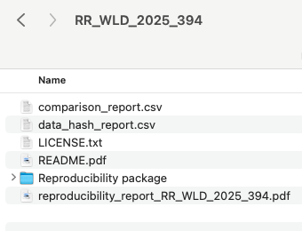

[](./index.html)
 
# PRWP Reproducibility Protocol

This protocol outlines the step-by-step process for verifying the reproducibility of research packages submitted to the World Bank’s PRWP verification team. It ensures that findings can be independently reproduced using the submitted code, data, and instructions. The protocol covers the full workflow—from submission and completeness checks (including data access and documentation), to running the package in a clean environment, tracking changes via version control, verifying consistency with the manuscript, and ultimately publishing the final reproducibility package.

In brief, the process looks like:


Find the detailed workflow below:

## 1. Receive Submission
 
- Submissions are received via the [submission form](https://survey.wb.surveycto.com/collect/prwp_reproducibility?caseid=).
- Once the form is submitted, the following happen automatically:
  - Authors receive an acknowledgment email indicating that a confirmation will follow within two business days.
  - The team receives a Slack notification indicating a new package has been received.
  - The **Reproducibility File Generator** Shiny app (internal) is updated - this app shows a list of all packages received.
- **Project coordinator** responsibilities:
  - Log each new submission in the GitHub project board. Open an issue with the format **ID: TYPE_LOCATION_YEAR_NUMBER** (example: RR_NGA_2024_213) - either create the issue manually or use the Shiny app to publish it to GitHub.
  - Type options are the following:
    - **PP**: Published paper.
    - **RR**: Policy Research Working Paper.
    - **FR**: Flagships and reports (includes databases).
  - Assign a reviewer and download the submitted files.
  - Store files in the designated internal SharePoint folder, structured as follows. `v1` is always created upfront; additional version folders are added if new versions are received.
 
```
RR_NGA_2024_213/          <- named after the package ID
├── files_submitted/      <- files submitted by the authors
│   ├── v1/
│   └── v2/               <- added if a new version is received
├── results/              <- verification report and outputs
│   ├── v1/
│   └── v2/
└── package RRR/          <- final package as published on RRR
    ├── v1/
    └── v2/
```
 
- _Special Case_: If a package is submitted via email instead of the form, respond with a request to complete [the submission form](https://survey.wb.surveycto.com/collect/prwp_reproducibility?caseid=), and share the [reproducibility guidance resources](https://worldbank.github.io/wb-reproducible-research-repository/) in your reply.
 
**General notes**:
- **Record Time Spent**: Record the total time spent on the review from receipt to publication. You can use [Toggl](https://track.toggl.com/) for accurate tracking.
- **Document Author Communications**: Author communications should be documented in the GitHub issue, either by copying the full email or summarizing key discussion points and dates. If coordinator review is needed, reviewers can tag the coordinator in the issue.
 
---
 
## 2. Download and Set Up the Package
 
- [ ] Open GitHub Desktop, go to **Add -> Create New Repository**, and select the location where you will store the package.
- [ ] Add a `.gitignore` file. A `.gitignore` tells Git which files to exclude from tracking. We use Git here for two purposes: to track any changes we make to the code in order to run the package, and to track changes in outputs across runs. We track code files and output files like `.csv`, `.tex`, `.txt`, `.png`, and `.jpg`. We do not track binary files like `.dta` and `.xlsx` as Git cannot show meaningful differences in these formats. The raw data folder should also be excluded regardless of file type to save space. Use the following as a starting point, but adapt it as needed — particularly the raw data folder name:
 
```
## This .gitignore is for reproducibility packages to track changes in outputs only
 
## Binary output files - Git cannot show meaningful diffs for these
*.pdf
*.xlsx
*.xls
*.dta
*.zip
*.docx
*.doc
*.stswp
*.rar
*.7z
 
## R and system files
.Rhistory
.DS_Store
 
## Ignore the raw data folder
## Note: adapt the folder name to match the package structure - common names include
## raw_data, data, Data, raw, Raw Data, etc.
/raw_data
```
- [ ] Download the package from the designated SharePoint folder into the repository location.
- [ ] Commit the initial package submitted by the authors.
 
> **Important:** This is a local repository only. Do not publish it to GitHub.com at any point.
 
This setup allows you to track any changes made to the code and see how outputs change across runs, making it easy to identify discrepancies between the author's original package and your working version.
 
---
 
## 3. Review Package Contents
 
### 3.a Verify Completeness
 
Before proceeding, verify that the package has enough to work with. If anything critical is missing, return the package to the author before running the code.
 
- [ ] Code files going from original data to the results in the paper. The package should not include unrelated files or old versions of code.
- [ ] The raw data files required for analysis.
- [ ] The raw outputs.
- [ ] A README file that documents data sources, access restrictions, and instructions for running the code. Data details may also be provided in a separate data availability statement.
- [ ] A link to the manuscript (if already published) or the manuscript itself.
- [ ] Make note of any missing components, even if they do not affect the running of the package.
 
**When to return the package to the author:**
- No README and no information on the data.
- If there is no main script but the README is clear, the package can be accepted - though a main script is strongly preferred.
 
### 3.b Verify Data Access
 
- [ ] Verify the status of the data: is it public, is it private, or is it public but can't be redistributed?
  - If the data cannot be directly included in the package (private, confidential, or public but not allowed to be republished), verify that the data is accessible by following instructions in the README or data availability statement.
- [ ] Verify that data provenance information is complete. This should include:
  - Dataset name
  - Date it was accessed. Month, year is enough.
  - If the data is accessible on a website, it should have a URL where it can be downloaded.
  - If the data is restricted, the data information should include how it was accessed and how other users could access it.
- [ ] Verify that the README includes a Statement about Rights.
- [ ] Initiate the entry in the metadata editor and verify that we have everything we need for the publication of the package, especially in terms of clarity in the data sources. This can also be done closer to publication if not all information is available at this stage.
- [ ] If the package does not have enough information on the data, ask the authors for all missing information.
 
### 3.c Verify Public Data
 
- [ ] For datasets that are publicly accessible but cannot be republished in the package, verify that the publicly available version matches the data provided by the authors.
  - Use the [Dataset Comparison and Reproducibility Verification Tool](https://github.com/worldbank/wb-reproducible-research-repository/tree/main/resources/compare_datasets) to compare datasets.
  - The tool will generate a `detailed_report.csv` that **must** be included in the final package.
  - Document any differences between the two versions:
    - If differences are due to **periodic updates**, note this in the verification report.
    - If differences are due to **manual changes**, request that the authors ensure the correct version is used and included in the package.
- [ ] Create dataset hashes for all data files used in the package.
  - Use the [Data Hash Tool](https://github.com/worldbank/wb-reproducible-research-repository/tree/main/resources/generate_hash) to generate hashes.
  - The tool will produce a hash report file that must be included in the final reproducibility package.
 
---
 
## 4. Run the Code
 
### 4.a Set Up a Clean Environment
 
Set up a clean programming environment before running the package. This ensures that the results are not affected by packages or dependencies already installed on your machine, and that the environment can be replicated by others.
 
- [ ] Follow the environment setup instructions for the relevant software:
  - **Stata:** [Link to instructions](https://worldbank.github.io/wb-reproducible-research-repository/resources/environment-instructions/stata.html)
  - **R:** [Link to instructions](https://worldbank.github.io/wb-reproducible-research-repository/resources/environment-instructions/R.html)
  - **Python:** [Link to instructions](https://worldbank.github.io/wb-reproducible-research-repository/resources/environment-instructions/python.html)
 
### 4.b Run the Package
 
- [ ] **Delete existing outputs and intermediate data** before running the package.
  - If it is clear from the package structure which files are intermediate data and which are outputs, delete them before the first run.
  - If it is not clear, skip this step for the first run and delete outputs and intermediate data before the second run.
  - If the package contains files (e.g., Excel files) where authors manually transformed results into figures, do **not** delete these files. Ensure they are explained in the README.
- [ ] **Run the package from start to finish** by only changing the top-level directory.
- [ ] **Troubleshoot errors** if the package does not run. Often, these are due to missing dependencies.
- [ ] **Document any code modifications** needed for a successful run. All changes are tracked in Git automatically - use these commits to document changes in the GitHub issue.
- [ ] **Commit your progress** to the Git repository with the commit message: `first-run`.
 
#### Document these critical aspects as you run the package:
 
**Dependencies**
- [ ] Record all libraries, packages, and dependencies required. These will be saved in:
  - Stata: `ado` folder
  - Python: `environment.yml`
  - R: `renv.lock`
 
**System Information**
- [ ] Record the following for inclusion in the reproducibility report:
  - Operating system
  - Processor
  - Available memory
  - Software version (including Stata edition if applicable)
 
### 4.c Verify Stability
 
- [ ] Run the package a second time to ensure results are stable.
  - If the package takes more than 24 hours to run, a second full run is not required.
- [ ] Use Git to track changes between runs. Stable outputs should show no changes in `.txt`, `.png`, `.jpg`, or `.csv` files. Changes in `.dta` and `.xlsx` files are expected due to metadata (e.g., timestamps) and do not indicate instability.
- [ ] If discrepancies occur:
  - Document the differences and update the Git repo.
  - For Stata packages, run `reprun` to locate where discrepancies arise.
  - For R/Python packages or if `reprun` does not work, discuss with the coordinator or team.
  - Return the package to authors with a detailed explanation of the issues.
 
### 4.d Send Confirmation to Authors
 
- [ ] Send confirmation to the authors that the package has been received and reviewed.
- [ ] Include an estimated report return date (2 weeks).
- [ ] Flag any missing information required for publication.
 
**Do not proceed to the next step if any of the following apply - return the package to the authors first:**
- The code starts from constructed data rather than raw, documented source data. Inform the authors of the reproducibility guidelines and request that the package be revised to start from documented source data.
- The code is unstable - results change across runs.
- There is no data statement available and there is reason to believe the underlying data may have changed since the analysis was conducted.
 
---
 
## 5. Verify Consistency with the Manuscript
 
- [ ] Identify which exhibits need to be verified. Note any exhibits that do not require reproduction, such as timeline figures or tables not produced by the code provided.
- [ ] For papers with more than 10 exhibits in the appendix, randomly select 10 for review using [this randomization code](https://github.com/worldbank/wb-reproducible-research-repository/blob/main/resources/select_appendix_exhibits.do).
- [ ] Compare the raw outputs generated when running the package to the exhibits in the paper:
  - **Tables**: Check for consistent observation numbers, identical coefficients and standard errors, and matching signs and significance indicators.
  - **Graphs**: Ensure axes, legends, and visual values are consistent.
- [ ] Document any discrepancies exhibit by exhibit. If exhibits do not reproduce, check against the authors' own code outputs if included in the package - this can indicate whether the manuscript was not updated to reflect the latest outputs.
 
---
 
## 6. Draft Reproducibility Report
 
For detailed instructions on how to complete the report, refer to the [Reproducibility Report Template Instructions](https://github.com/worldbank/wb-reproducible-research-repository/tree/main/resources/reproducibility_report_template).
 
- [ ] If needed, send the draft report to the coordinator for review before sending it to the authors.
- [ ] **Successful Reproduction**: Move to the next step.
- [ ] **Unsuccessful Reproduction**: Send the report by email with a summary of the exhibits that did not reproduce and actionable suggestions on how to address the issues. Discuss with the coordinator or team if needed.
 
---
 
## 7. Prepare Metadata and Publication
 
For full instructions on preparing metadata and publishing the package, refer to the [Metadata Editor Protocol](https://github.com/worldbank/wb-reproducible-research-repository/blob/main/metadata_protocol.md).
 
- [ ] Ensure the metadata entry is complete and reflects all information collected during the review - including data sources, access status, and any issues flagged.
- [ ] Zip the results folder and upload it to the respective SharePoint folder.
- [ ] Zip the reproducibility package folder and upload it to the respective SharePoint folder.
- [ ] Ensure the README is in PDF format. If not, convert it and name it `README.pdf`.
- [ ] Check if the package includes a license. If not, add a Modified BSD3 license available [here](https://opensource.org/license/bsd-3-clause/), starting with: "Copyright (year), World Bank".
- [ ] The final package should have the following structure:
 

 
---
 
## 8. Publish Package to reproducibility.worldbank.org
 
- [ ] Draft the catalog entry on QA and have it reviewed by the reproducibility initiative TTL.
- [ ] Once approved, publish the entry to PROD.
 
---
 
## 9. Send Reproducibility Report and Package to Authors
 
- [ ] Send the finalized report with the link to the published package to the authors, including any pending issues.
 
---
 
## 10. Update the Status of the Review in the GitHub Dashboard
 
- [ ] After a package is published and sent to the authors, update its status to `Published with missings` or `Done`:
  - `Published with missings`: in case it's still pending to update the thumbnail and include the paper DOI, URL, and PRWP number. This will be applicable for most cases. If the thumbnail is pending to be updated, add the label `Pending in RRR: thumbnail`. If the data is pending publication, add the label `Pending in RRR: data`.
  - `Done`: in case the package is finalized and there is no missing information in the entry.
- [ ] Add the total time spent on the review. This should include everyone's time, including the coordinators, interns, and all team members.
- [ ] If missing, add the total number of submissions the review took.
- [ ] Fill any missing information on the dashboard.
 
---
 
# Special Cases
 
## New Versions of a Published Entry
 
New versions are updates of the code or data that follow a modification of a manuscript exhibit or a new exhibit that was not included in the original reproducibility package. A new version should be included as a new entry in RRR. Updates only to the documentation or metadata are not considered new versions and can be updated in the same entry. Cases that do not fall in these examples should be discussed in the weekly team meeting.
 
Follow these steps to update a new version of a reproducibility package:
 
- [ ] Create a new entry for the latest version using the same ID + `v2` (or `v3` or `v4` if it's the third or fourth version). You can download the metadata JSON of the original entry and upload it so you don't have to fill in all the fields from scratch.
- [ ] In the new entry, make sure to update any relevant fields, especially the field `version` in Metadata Information.
- [ ] Once approved by the coordinators or TTL, publish the new version to prod.
- [ ] Notify Thijs that there is a new version of an existing package so he can create the new DOI of the new version.
- [ ] Add these changes to the original version:
  - Take note of the old version's DOI and save it.
  - Add: `[OLD VERSION]` to the entry title. It should look like this: `[OLD VERSION] Reproducibility package for Effects of a community-driven water, sanitation, and hygiene intervention on diarrhea, child growth, and local institutions: a cluster-randomized controlled trial in rural Democratic Republic of Congo`.
  - Add: `[PLEASE NOTE THAT THIS REPRODUCIBILITY PACKAGE WAS UPDATED TO A NEW VERSION. THE UPDATED VERSION IS AVAILABLE IN THIS LINK: https://reproducibility.worldbank.org/index.php/catalog/XXXXXXXXXXXXX]` as a prefix to the abstract.
  - Publish these two changes to prod.
  - Remember that updates to prod delete the DOI. From the admin prod portal, manually add the DOI you previously saved.
- You can see an example of an updated entry [here](https://reproducibility.worldbank.org/index.php/catalog/222)
 

[](./index.html)
