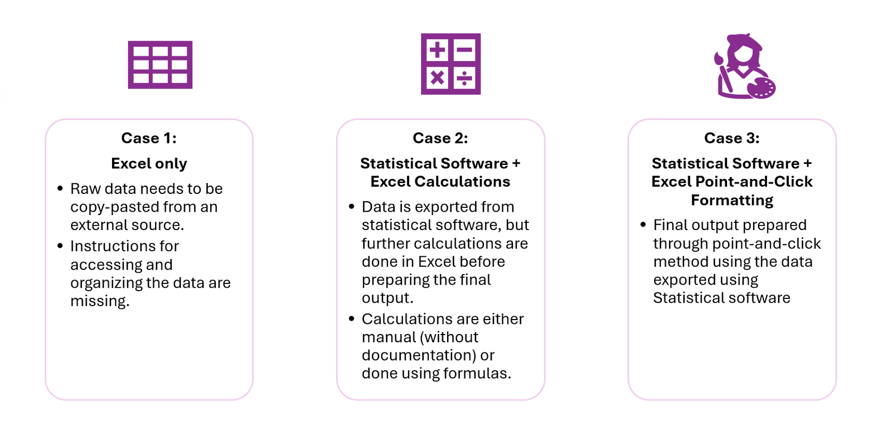
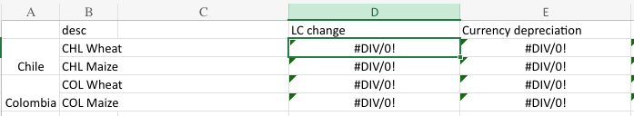

## Overview

In our commitment to enhancing reproducibility, it is essential to address the inherent challenges posed by manual steps in **Excel-based packages**. We aim to bridge this gap through automation and comprehensive documentation. The following guidelines are designed to structure Excel files to improve transparency, minimize manual intervention, and streamline the verification process for replicators.

In our experience, we’ve encountered **three** common cases when it comes to packages that use Excel:

-   If your package falls under **Case 1**, we recommend reviewing the entire document thoroughly.
-   If your package falls under Case 2 or Case 3, focus on Point 4 in [Setting up Excel: Best Practices to Follow](#setting-up-excel-best-practices-to-follow) as well as [Using Excel as a Secondary Software](#using-excel-as-a-secondary-software).

## Setup

Ensure that the package contains **only** the materials used in the outputs to maintain clarity and conciseness. Exclude any irrelevant data or files.

### Contents of the package:
1.  README
2. Manuscript
3.  Data
	- Raw, unaltered data from primary or secondary sources.
4.  Outputs
	- Excel workbooks with input data, calculations applied, and outputs

The reproducibility package should **not** include:

-   Any worksheets or datasets that are not necessary for the set of results included in the paper  (or appendices)
-   Any extraneous documentation  (such as project notes or internal communication)

### Contents of the README:

1. **Overview**
- Brief description of the project and contents of the package

2. **Data Availability Statement**

- Details about data sources and accessibility, and instructions for replicators on how to access it:

	- Source Information and Accessibility: Include URLs or access instructions for requesting restricted data.
	- Data Specifications: List the variables, time periods, etc. used to download the data.
	- Download Instructions: Clearly outline steps to download and incorporate data into the Excel sheets (e.g., which sheets, columns, rows, and cells.).

3.  **List of Excel Workbooks/Sheets**
- Provide the following for each:

    - Input datasets for each sheet/workbook.
	- Exhibits being created by that sheet.
	- Columns used for the exhibit  (if not all columns are included).
	- For restricted datasets, include detailed setup instructions so replicators can properly configure the Excel sheets.

## Setting up Excel: Best Practices to Follow

1.  **Preserve Original Data:**

-   Always start with the raw data in its unaltered form.
-   Place raw data in the initial sheets of your workbook  (e.g., Sheet 1).  Never overwrite the cells  that contain the raw data.
-   Document the source data, and ensure that the data in the sheet matches the source data.
	- Document any modifications from the source, for example, if only a subset of variables or observations are included). Subsequent sheets can display processed or cleaned data where transformations and calculations have been applied using Excel’s formulae and functions.

2.  **Organize Sheets Logically:**

-   Include a  “README” sheet at the beginning of the workbook with a directory of contents.
-   Organize workbooks and sheets following the logical flow of the exhibits or analysis. If the output from one sheet feeds into another or informs subsequent analyses, arrange them sequentially.
-   If multiple exhibits share the same input data, consolidate them into one workbook with separate sheets for clarity and better data management.
-   Label each sheet clearly based on its content  (e.g.,  “raw”,  “processed”,  “table1”,  “fig1a”).
-   Use consistent color-coded tabs to help differentiate between data types.

3.  **Optimize Data Management and References:**

-   Remove unnecessary sheets, rows, or columns from analysis or output worksheets that are not directly involved in the final results.  _(Important:_ _Do not manually alter or delete any raw input data.)_
-   Avoid duplicating sheets unnecessarily across different workbooks. If multiple sheets contain similar data, consolidate them into a single workbook to reduce redundancy.
-   Ensure all data references are internal within the workbook.
-   Avoid linking to external Excel files not included in the reproducibility package to prevent issues with missing files or broken paths.

  

4.  **Ensure All Changes are Traceable**

-   Use formulas or macros to modify raw data, ensuring that every change made to the data can be traced back to its origin and documented.
-   This approach ensures transparency; any researcher can follow the workflow step-by-step to verify results or conduct further analysis.
-   Avoid making manual changes to the data to reduce errors.
-   If manual steps like copy/pasting are necessary, document these steps clearly in the README for future reference.

## What will be published?

**If the raw or Intermediate data can be republished:**

-   The Excel file will be shared as is and no modifications would be made

  

**If the raw or Intermediate data cannot be republished:**

-   The Excel file will contain only formulas and macros. Any sheet or column that requires non-publishable data will be left blank, and formula outputs will display placeholders, as shown below:

-   Once the data is downloaded and added according to the instructions, these cells will generate the expected outputs.
-   In such cases, **clearly document in the README file** **precisely** **where users need to** **place** **the** **input** **data** to fully replicate the paper's results. This documentation is crucial to ensure that users understand exactly how to replace missing data and achieve the correct outputs.

## Using Excel as a Secondary Software

If Excel is used alongside statistical software like Stata or R  (e.g., for creating figures or tables in Excel after processing data in the software), follow these guidelines:

  

1.  **Automate as much as possible in the statistical software**. The only tasks in Excel should be formatting or creating figures/tables with data exported from the software.

-   Learn more about setting up an automated workflow [here](https://osf.io/aupxy)
-   Leverage visual libraries to automate figure creation: [Stata](https://worldbank.github.io/stata-visual-library/index.html), [R](https://worldbank.github.io/r-econ-visual-library/)
-   For questions or support on automation, contact [**reproducibility@worldbank.org**](mailto:reproducibility@worldbank.org).

2.  **Use formulas for any required calculations**—avoid manual calculations to minimize errors and ensure transparency.
3.  **Document any additional steps clearly** so that replicators can easily follow the process.

## Published packages that use Excel

1.  [Reproducibility package for The 2022 global food price shock in Chile and Colombia](https://reproducibility.worldbank.org/index.php/catalog/157/study-description)

-   **Software:** Stata and Excel
-   This example includes a clearly documented README that explains in detail any manual steps required.

  

2.  [Reproducibility package for Ensuring an equal start for all Pakistani children: What will it cost?](https://reproducibility.worldbank.org/index.php/catalog/133/study-description)

-   **Software:** Excel only
-   This example provided clear organization for input data, data wrangling, and exhibits.

3.  [Reproducibility package for Estimating Value Added Tax](https://reproducibility.worldbank.org/index.php/catalog/212)  [(VAT)](https://reproducibility.worldbank.org/index.php/catalog/212) [and Corporate Income Tax](https://reproducibility.worldbank.org/index.php/catalog/212)  [(CIT)](https://reproducibility.worldbank.org/index.php/catalog/212) [Gaps in Indonesia](https://reproducibility.worldbank.org/index.php/catalog/212)

-   **Software:** Excel only
-   This example features a **clearly documented README** along with a **well-structured set of Excel files** for easy navigation and understanding.

